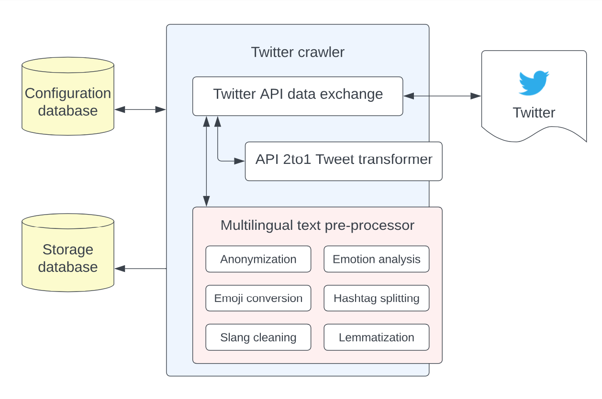

# <center> TweetByMe </center>
## a tool for monitoring and storing multilingual data from Twitter

<p align="center">
    
</p>

 

**TweetByMe is a Twitter crawler developed for the StandByMe EU project.** 

The objective of the StandByMe project is to **counter online violence against women and girls** ('VAWG') via youth actions in Italy, Poland and Hungary and the rest of Europe. This goal is pursued through a comprehensive blended learning program composed of offline and online educational materials. Students are empowered in taking action against online VAWG, by facilitating their ability to detect it and supporting their voice as change agents.

In this framework, we develeped a tool devoted to analyze online trends on violence against women and girls. The tool is meant to be general-purpose, because it monitors tweets by looking for query terms provided by users. In our case, query terms were defined by the domain experts in the project consortium, who helped in creating a keyword matrix in Italian, Hungarian and Polish, to identify misogynistic tweets.The goal is the constitution of a knowledge storage with examples of misogynistic language, that will enable and support activities to counter VAWG.

In particular, in the current page we release:

- [TweetByMe](system-description), a software for monitoring and preliminary text processing of Twitter data
- the [domain-specific hashtags and keywords](domain-specific-hashtags-keywords) used to populate, via our software, the project knowledge base with examples of misogynistic language in the three project languages, i.e. Italian, Polish and Hungarian.


### System overview 

TweetByMe is a tool for capturing, processing, analysing and storing social media data and has the following features:

- operates with the new version of Twitter endpoints (APIv2)
- outputs data in a standard v1.1 *json* format 
- stores the output data in MongoDB
- handle in a straightforward manner a high number of keywords (up to 1,000 keywords, limit of number of rules by by Twitter)  
- performs anonymization of data
- performs a variety textual pre-processing in different languages (emotion analysis, lemmatization, hashtags splitting)
- performs data crawling in a customizable time range (with an academic twitter bearer)
- it can be configured to download trending topics


### System description 

The fundamental and central element of TweetByMe is the Twitter crawler, that coordinates the action of several components and of two databases. 
The Twitter crawler includes three subcomponents: one in charge of the exchanges with Twitter endpoints, a component in charge of managing data format, and a component in charge of several operations of data pre-processing (containing several modules). The Twitter crawler interacts with two databases in charge of storing respectively the configuration of the system and the output data.

<p align="center">


<b>Fig. 1</b>:The system architecture diagram of TweetByMe</i>
</p>

### Twitter crawler 
This component is the main executable of the software, and it is written in Java.
At the first execution of the Main class, an empty and new configuration database is created after which the the program ends. Once the configuration database is created, it is necessary to insert the parameters into the configuration database.
During the second run, the software finally connects to Twitter and starts performing the desired operations. If needed, a file called application.properties can be created in the root folder of the application, where some other variables can be set up. Among them:
```
spring.datasource.url: the path of the SQLite database (default jdbc:sqlite:./tweet-repository.db)
spring.data.mongodb.database: name of the MongoDB database
spring.data.mongodb.host and spring.data.mongodb.port: host and port of MongoDB
```
To download tweets, the Twitter-crawler app uses the stream capabilities of Twitter APIs, therefore the desired rules are added to the stream ones. The tool waits for the stream to get the tweets as users post them on the social network.
When something goes wrong (for any reason) and the software is restarted, the missing tweets are recovered, since the SQLite database contains the timestamp of the last tweet that has been downloaded correctly. 
Once a tweet is retrieved, it is passed through the Twitter API 2to1 transformer and the Multilingual text preprocessor and the resulting data is saved into the MongoDB database. Since the stream API is used, the same bearer token cannot be used for more than one instance of the Twitter-crawler.

### Configuration database ###
These parameters are stored in a table called “option”:
```
- twitter.bearer (*): Twitter API v2 key 
- app.empty_db: if ‘1’, it cleans all the data on next reboot (default ‘0’)
- tweet.converter_host, tweet.converter_port, tweet.converter_protocol, tweet.converter_address (*): location of the API 2to1 Tweet transformer 
- tweet.ppp_host, tweet.ppp_port, tweet.ppp_protocol, tweet.ppp_address (*): location of the multilingual Text preprocessor 
- app.run_update_previous: if ‘1’, in case of crash, recover missing tweets (default ‘1’)
```
Keywords and hashtags to be monitored are saved in a table called “forever_tag”, with the following fields:
```
- id: a unique numeric identifier
- tag: the hashtags/keywords
- lang: the language of the tweets to be downloaded, in the ISO 639-1 format (for example “en”, “it”, etc.)
- insert_time: the time the record is inserted into the database (usually “now”, in timestamp format)
- start_time, expired_time: the time span we want to collect the tweets (timestamp format)
```
### Twitter API data exchange and Twitter API 2to1 transformer ###
TweetByMe uses version 2 of Twitter endpoints (APIv2).
This component receives the tweets in the APIv2 format and each tweet is transformed into standard v1.1. (Details here https://developer.twitter.com/en/docs/twitter-api/migrate/data-formats/standard-v1-1-to-v2 )

### Multilingual text pre-processor ###
Once the tweet has been retrieved from the API and converted in the standard json format, it is sent to this component that executes a number of tasks: anonymization of data, emoji conversion, emotion analysis, hashtags splitting, elongated normalisation, lemmatization. The different subcomponents, which were developed in Python, are modular, and it is therefore possible to configure which tasks to execute and in which order.

The subcomponents are: 

- *Anonymization of data*: user mentions, URLs, and mentioned email addresses are replaced by a dedicated tag (<user>, <url>, <mail>). All the instances of “money”, “time”, “date” and in general any “number“ are also replaced with a dedicated tag (<time>, <number>, <date>). It is executed using the Ekphrasis tool (Gimpel et al., 2010). This ensures also that any form of personal information or profiling is not included in the process, in compliance with StandByMe privacy requirements and GDPR. The username associated with the Twitter account are deleted.
- *Emoji conversion*: the emojis are replaced with their textual descriptions to ease further processing.  The textual descriptions originally available for English (https://unicode.org/emoji/charts/ full-emoji-list.html). Available languages: . 
- *Hashtags splitting*: we used the Ekphrasis tool (Gimpel et al., 2010) to recognise the tokens in a hashtag based on n-grams frequencies. Available languages: 
- *Elongated normalisation (slang cleaning)*: Words ending with repetitions of the final letter (e.g. “hellooooo”) are used very frequently in social media posts to emphasize their content. These occurrences are normalised into the regular words (e.g. “hello”). Available languages: 
- *Lemmatization*: inflected words are converted into their dictionary forms, using the Spacy library (https://spacy.io/). Available languages: 
- *Emotion analysis*: the emotion detection algorithm applies a dictionary-based approach to match the words in a social media post with the terms listed in the widely used NRC Word-Emotion Association Lexicon (Mohammad et al., 2013), which have been manually associated with eight basic emotions (i.e., anger, fear, anticipation, trust, surprise, sadness, joy, and disgust). The output is an integer value for each of the eight emotions, indicating their presence in a message. Available languages: 

At the end of this process, the following changes have been made to the initial json format for each tweet:

- the field ‘text’ is now anonymized
- the field ‘user’ is now anonymized
- an additional field ‘emotions’ is added with the results of emotions analysis 
- an additional field ‘text preprocessed’ is added with the text pre-processed (anonymization, hashtag splitting, elongated normalisation, emoji conversion) in a form that is suitable for performing further text analysis 


### Storage database ###
Data collected and preprocessed in the previous steps are finally saved in a MongoDB database (https://www.mongodb.com/), where it can be queried for statistical purposes. The database can be hosted on a server (see Twitter-crawler to configure route to database).


# Domain-specific hashtags keywords 
Particular attention was paid in the creation of the keywords list that led to the creation of the StandByMe knowledge base of misogynistic messages. 
Creation of the keywords list was based on a taxonomy derived from existing literature related to misogyny and sexism detection. For each category of the taxonomy, terms were defined that aimed to gather tweets representing the category. This task was executed by domain experts in the project consortium, mother-toungue in Italian, Hungarian and Polish.
The taxonomy and the keywords used for each category and language are availble in [`keywords_list/`](keywords_list/) folder. The folder contains the query to populate the configuration database with TweetByMe.
